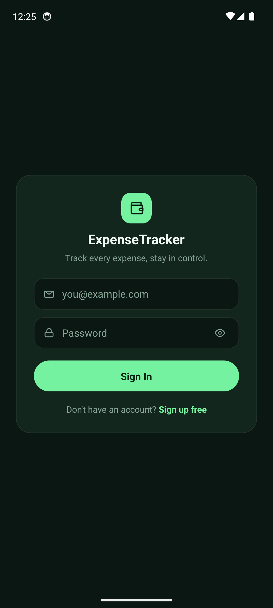
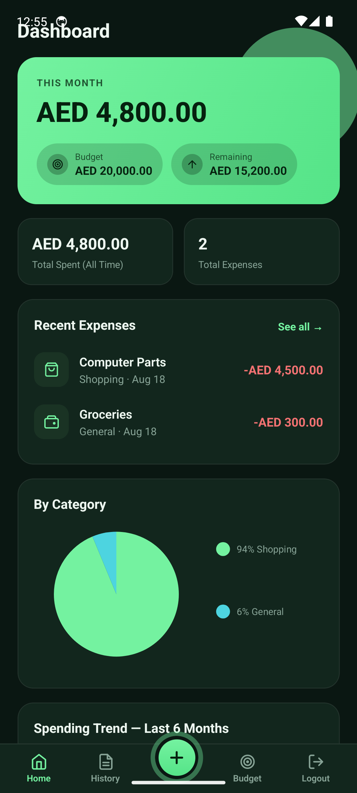
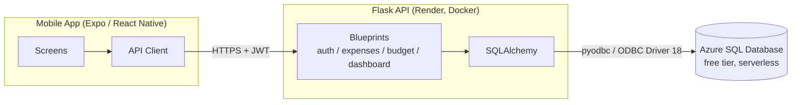

# Expense Tracker

[](https://github.com/DondieGatan/expense-tracker/actions/workflows/ci.yml)

A personal expense tracker: a **Flask** REST API backend (Python, SQLAlchemy,
SQL Server) with a **React Native** (Expo) mobile app frontend, with budget
tracking, dashboard charts, and CSV export on top of full CRUD.

| Login | Dashboard |
|---|---|
|  |  |

**Live backend:** https://expense-tracker-api-hlyz.onrender.com/api/health
(free-tier hosting — the first request after ~15 min idle takes 30-50s to wake up
while the instance and its Azure SQL database spin back up; the app retries with
a "waking up the server" message rather than failing outright)

## Architecture



The API and database deliberately live on different cloud providers (Render for
compute, Azure for SQL Server). That surfaced a real bug worth noting: the first
Azure SQL Database was provisioned in the region closest to where the app was
being built (UAE), not where Render actually runs its servers (Oregon, US) — every
connection attempt from the backend to the database hit a login timeout, while
connecting from a local machine worked fine. It looked like a firewall problem at
first (and a genuine firewall gap was fixed along the way), but a temporary
raw-TCP-connect diagnostic route on the backend proved the network path was fine
in under 20ms — the real fix was moving the database to `westus2`, next to
Render's servers.

## Features

- **Accounts** — register/login with short-lived JWT access tokens, long-lived
  refresh tokens, and server-side revocation on logout (a DB-backed blocklist,
  not just deleting the token client-side); every user only ever sees their
  own data, enforced at the query level
- **Log expenses** — description, amount, category, date, and payment
  method, with server-side validation
- **Edit / delete** any logged expense
- **Search and filter** the expense list by description, category, and date
  range, in any combination
- **Monthly budget** — set a spending limit and track it against the
  current month's spending
- **Dashboard** — total spent, this month's total, expense count, a
  category-breakdown donut chart, and a 6-month spending trend chart
- **CSV export** of the expense list, respecting whatever filters are
  currently applied

## Project layout

```
backend/    Flask REST API (SQLAlchemy models, JWT auth, blueprints per resource)
mobile/     React Native (Expo) app that consumes the API
```

## Data model

A `User` (`id`, `fullName`, `email`, `passwordHash`), an `Expense`
(`id`, `userId`, `description`, `amount`, `category`, `date`,
`paymentMethod`, `notes`), and a per-user `Budget` (`id`, `userId`,
`monthlyLimit`) — managed through Flask-Migrate/Alembic migrations against
SQL Server.

## API reference

All endpoints are prefixed with `/api` and (except `/health`, `/auth/register`,
`/auth/login`, `/auth/refresh`) require `Authorization: Bearer <accessToken>`.

| Method | Path | Description |
|---|---|---|
| GET | `/health` | Liveness check |
| POST | `/auth/register` | Create an account, returns access + refresh tokens |
| POST | `/auth/login` | Returns access + refresh tokens |
| POST | `/auth/refresh` | Exchange a refresh token for a new access token |
| POST | `/auth/logout` | Revoke the current access token (and refresh token, if provided) |
| GET | `/auth/me` | Current user |
| GET | `/expenses` | List expenses (filters: `category`, `q`, `from`, `to`) |
| GET | `/expenses/export` | CSV export of the same filtered list |
| GET | `/expenses/categories` | Available categories + payment methods |
| GET/POST | `/expenses/:id` | Get / create an expense |
| PUT/DELETE | `/expenses/:id` | Update / delete an expense |
| GET/PUT | `/budget` | Get / set the monthly budget |
| GET | `/dashboard` | Aggregated totals, category breakdown, 6-month trend |

## Run the backend

Requires Python 3 and a reachable SQL Server instance (defaults to
`localhost\SQLEXPRESS` with Windows/trusted authentication — override via
`SQL_SERVER`/`SQL_DATABASE`/`SQL_DRIVER`/`SQL_USERNAME`/`SQL_PASSWORD`
environment variables).

```bash
cd backend
python -m venv venv
venv/Scripts/activate       # or source venv/bin/activate on macOS/Linux
pip install -r requirements.txt
flask db upgrade            # apply migrations
python run.py                # serves on http://localhost:5100
```

## Run the mobile app

Requires Node.js.

```bash
cd mobile
npm install
npx expo start --web         # or --android / --ios
```

The app talks to the API at `http://localhost:5100/api` by default (or
`10.0.2.2` on the Android emulator). Set `EXPO_PUBLIC_API_URL` to point at a
deployed backend instead — see `mobile/src/api/client.ts`.

## Deployment

- **Backend**: Docker image on Render (`backend/Dockerfile`), not the native
  Python runtime — Render's native runtime has no `apt` access, and pyodbc
  needs the Microsoft ODBC driver installed at the OS level. The image is
  pinned to `python:3.12-slim-bookworm`; the plain `slim` tag now tracks
  Debian 13 (trixie), which dropped `apt-key`, so the driver is installed via
  Microsoft's `packages-microsoft-prod.deb` instead.
- **Database**: Azure SQL Database, serverless compute with auto-pause, on
  the free tier (100,000 vCore-seconds + 32GB/month, not billed unless that's
  exceeded). Provisioned in `westus2` — see [Architecture](#architecture) for
  why region choice mattered here.
- **Mobile**: standalone Android APK via `eas build --platform android
  --profile preview`, distributed directly rather than through the Play
  Store. `mobile/eas.json` defines the build profile and bakes in the
  production `EXPO_PUBLIC_API_URL` at build time.

## Tests

```bash
cd backend
python -m pytest
```

The suite covers auth, CRUD, category/search/date filtering, budget
calculations, dashboard aggregation, CSV export, and cross-user data
isolation, using SQLite in-memory so no real database connection is
required to run it. CI runs the same command on every push via GitHub
Actions, alongside a TypeScript check for the mobile app.

## Stack

**Backend**: Python · Flask · SQLAlchemy · Flask-Migrate · Flask-JWT-Extended
· SQL Server (`pyodbc`) · pytest · gunicorn · Docker

**Mobile**: React Native · Expo · TypeScript · React Navigation ·
react-native-chart-kit · react-native-reanimated

**Infra**: Render (backend hosting) · Azure SQL Database · EAS Build
(Android APK) · GitHub Actions (CI)
